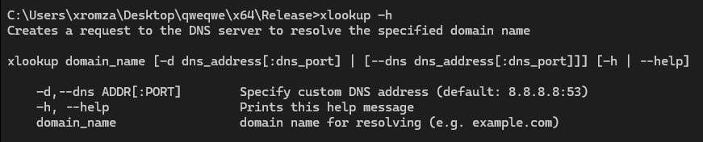
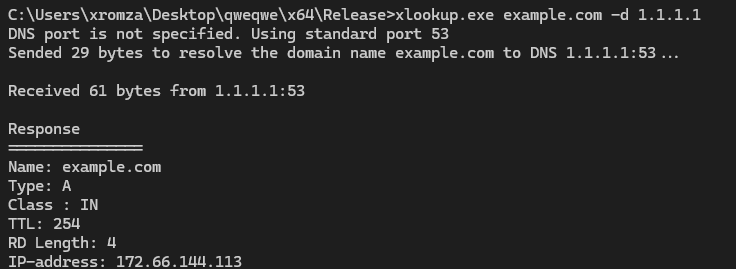

# xlookup (nslookup analogue) *by xromza* #
CLI tool. Creates a request to the DNS server to resolve the specified domain name
## How to use? ##
### Syntax ### 
`xlookup domain_name [-d dns_address[:dns_port] | [--dns dns_address[:dns_port]]] [-h | --help]`
### Args: ###
1.    -d,--dns ADDR[:PORT]        Specify custom DNS address (default: 8.8.8.8:53)
2.    -h, --help                  Prints this help message
3.    domain_name                 domain name for resolving (e.g. example.com)
## Advantages ##
1. Command-line arguments parsing
2. Using modern C++20
## Screenshots ##
1. 
2. 

From xromza with ❤️
